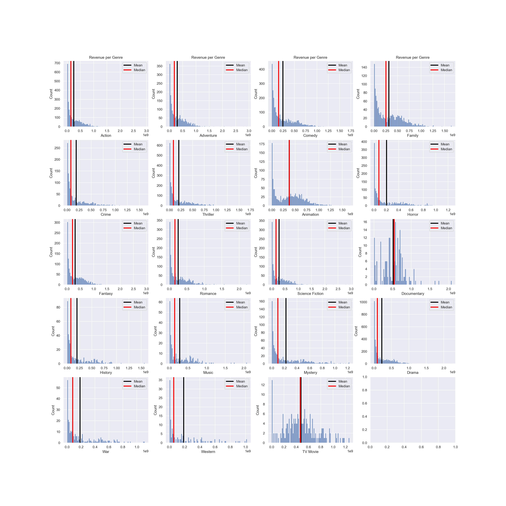
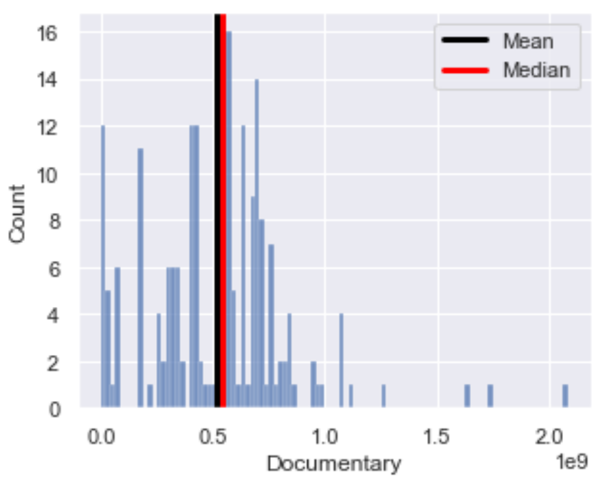
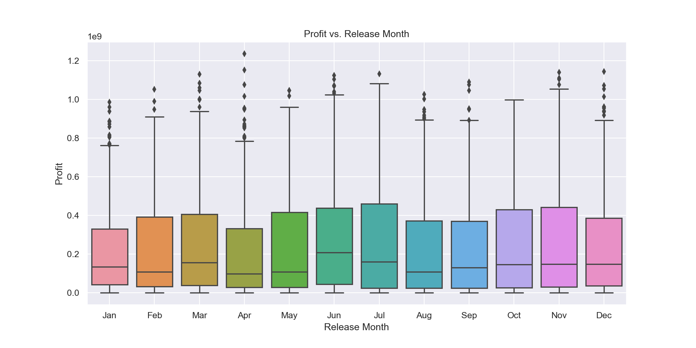
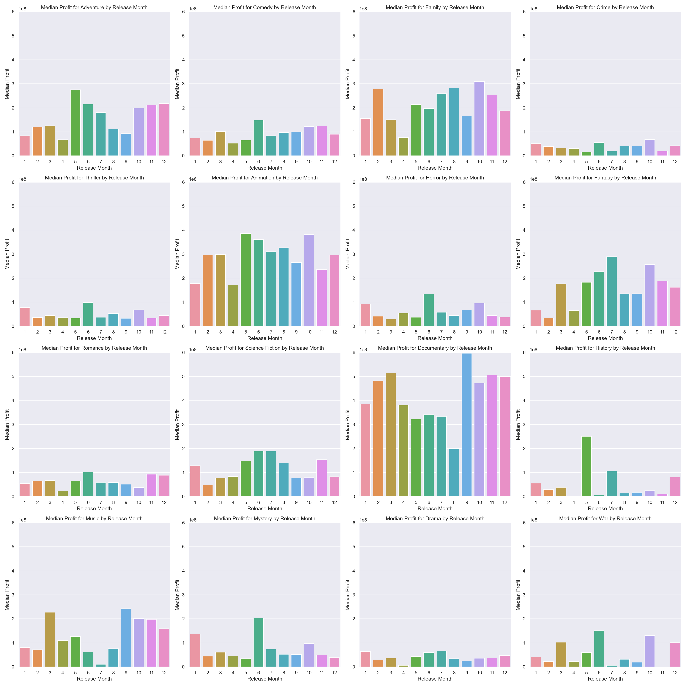
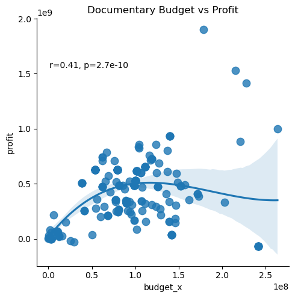

# Movie Data Analysis Project


**"Our Big Fat Greek T Distribution"**

**Authors**: [Rachel Goldstein](mailto:rachelhgoldstein1@gmail.com), [Nick Kai](mailto:nhknicholas@gmail.com), [Reyn Chagami](mailto:rchagami17@gmail.com)

## Overview

This project analyzes [data]([https://www.kaggle.com/datasets/khsamaha/aviation-accident-database-synopses](https://www.kaggle.com/datasets/ashpalsingh1525/imdb-movies-dataset)) from IMDB which has data from over 10,000 movies from all over the world from various genres over the last 35 years.

## Business Problem


We have been charged with exploring what types of films are currently doing the best at the box office by a new movie studio. We have been asked to translate our findings into actionable insights that the head of our company's new movie studio can use to help decide what type of films to create.

## Data

The IMDB database covers information regarding movies from the last 35 years, including Genre, Crew, Revenue, and IMDB score, to name a few of the categories.

## Methods

This project uses a variety of data cleaning methods to organize and subset the data such as: 
- Dropping irrelevant properties.
- Filling in null values.
- Filtering and Creating new categories to analyze different Genres

  
## Results

**This is our results when we decided to break down the average revenue per genre**
<p float="left">
   
  

**Documentaries were the most normally distributed while also being on a large scale**

```
revenue_means = {}

for genre in genre_list:
    mean = imdb_movies[imdb_movies[genre] == True]['revenue'].mean()
    revenue_means[genre] = mean
revenue_means
 [('Documentary', 504977146.8864198),
 ('TV Movie', 471846708.54651165),
 ('Animation', 401238719.48764336),
 ('Family', 347019522.43114257),
 ('Adventure', 340548869.7905797),
 ('Fantasy', 330199644.1764089),
 ('Science Fiction', 306093486.91767675),
 ('Music', 282985112.09090906),
 ('Action', 270245339.678607),
 ('Comedy', 239921005.32046333),
 ('Mystery', 221578726.14369604),
 ('Western', 220669465.25084746),
 ('Horror', 199979449.0441838),
 ('Thriller', 194499578.42893812),
 ('History', 189244794.9480176),
 ('Romance', 188007507.25579512),
 ('War', 182858934.16183206),
 ('Drama', 181894333.93492872),
 ('Crime', 167925962.76549864)] 
```

```
 revenue_medians = {}

for genre in genre_list:
    median = imdb_movies[imdb_movies[genre] == True]['revenue'].median()
    revenue_medians[genre] = median
revenue_medians_sorted = sorted(revenue_medians.items(), key=lambda x: x[1], reverse=True)
revenue_medians_sorted 

 [('Documentary', 542233172.2),
 ('TV Movie', 469568522.4),
 ('Animation', 392188196.0),
 ('Family', 319715683.0),
 ('Adventure', 250191298.7),
 ('Fantasy', 243434798.2),
 ('Science Fiction', 188584535.2),
 ('Music', 167362748.0),
 ('Action', 161929216.5),
 ('Comedy', 146599211.4),
 ('Western', 106515310.0),
 ('Mystery', 98677816.0),
 ('War', 97523020.0),
 ('Romance', 97374152.0),
 ('Horror', 81831866.0),
 ('Thriller', 80073583.0),
 ('History', 76665507.0),
 ('Crime', 71928453.0),
 ('Drama', 69387375.5)]
```


# Release Month
Regarding the release month, we found that although most genres have remarkably low margins in September, Documentaries scored particularly well 

<p float="left">
   
  

# Budget



Our regression model shows 
- a budget over $15 million had diminishing returns and higher variance in regard to profit.
- a budget between $10-$15 million had the highest profit

## Conclusions

Our 3 Actionable insights that we recommend are as follows.

#1
- Create a Documentary film
- Documentaries had some of the highest rates of profit while also having the lowest risk of negative revenue
- There seems to be some space in the market for more documentaries
- We also recommend making a Documentary in the Music subgenre as they seem to have some of the highest ratings and revenue scores across the board

#2
- Release it in September if possible, as Documentaries released during this month tend to have the highest average revenue
- If it is not possible to release in September, December, and November, also have a high rate of average revenue

#3
- Spend around $10-$15 million on your documentary
- There seems to be a positive correlation that if you spend at least $10 million on your documentary, it has a higher likelihood of profitability
- Do not spend more than $15 million on your documentary, as it seems the budget has diminishing returns on profit.

  

### Next Steps

**After this analysis, we are left with some questions ;**
***The biggest question is what effect crew has on a Documentary.***

-Is there a documentary director or narrator who tends to make more money on average than others? 

-We began looking into what subgenres have the highest gross revenue, as well as which were the most successful overall, but is there a possible correlation with the cast as well?

-**What types of Movies score the best?** One next step we would hope to take is to use machine learning to help create a predictive model of what types of movies would be most successful and create the most profit with what actors.


## For More Information

See the full analysis in the [Jupyter Notebook](Final%20Notebook.ipynb), review this [presentation](My%20Big%20Fat%20Greek%20T%20Distribution%20Slide%20Deck.pdf), or take a look at our [Tableau Dashboard](https://public.tableau.com/app/profile/nicholas.kai3061/viz/FinalDashPhase2Project/Dashboard1?publish=yes).

For additional info, contact Rachel Goldstein at [rachelhgoldstein1@gmail.com](mailto:rachelhgoldstein1@gmail.com), Nick Kai at [nhknicholas@gmail.com](mailto:nhknicholas@gmail.com), or Reyn Chagami at [rchagami17@gmail.com](mailto:rchagami17@gmail.com).

## Repository Structure
```
├── Code
│   ├── CONTRIBUTING.md
│   ├── LICENSE.md
│   ├── Nick Notebook.ipynb
│   ├── Rachel.ipynb
│   ├── Rachel_V2.ipynb
│   ├── Reyn.ipynb
│   └── movie_data_erd.jpeg
├── Images
│   ├── Documentary_Revenue_Count.png
│   ├── Hail_Ceaser.jpg
│   ├── avg_doc_genre.png
│   ├── avg_profit_per_genre.png
│   ├── avg_profit_per_genre_multiplot.png
│   ├── avg_revenue_per_genre.png
│   ├── budget_regplot.png
│   ├── genre_combo_top20_rev.png
│   ├── indiana.jpg
│   ├── mean_profit_by_genre_release_month.png
│   ├── median_profit_by_genre_release_month.png
│   └── profit_vs_release_month_boxplot.png
├── unzippedData
│   └── Duplicates
│       ├── imdb_movies.csv
│       ├── tn.movie_budgets.csv
│       ├── bom.movie_gross.csv
│       ├── imdb_movies.csv
│       ├── megadf.csv
│       ├── megadf2.csv
│       ├── megadf3.csv
│       ├── megadf4.csv
│       ├── rt.movie_info.tsv
│       ├── rt.reviews.tsv
│       └── tmdb.movies.csv
├── zippedData
│   ├── archive.zip
│   ├── bom.movie_gross.csv.gz
│   ├── im.db.zip
│   ├── rt.movie_info.tsv.gz
│   ├── rt.reviews.tsv.gz
│   ├── tmdb.movies.csv.gz
│   └── tn.movie_budgets.csv.gz
├── .gitignore
├── Final Notebook.ipynb
├── My Big Fat Greek T Distribution Slide Deck.pdf
├── README.md
└── file_in_root.ext
```
